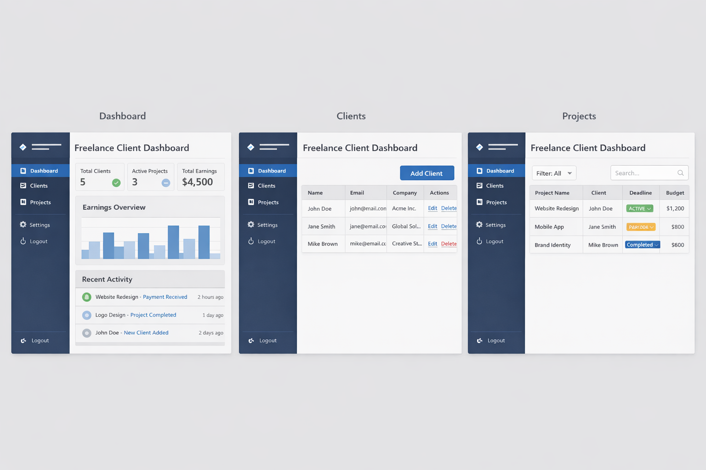

# Freelance Client Dashboard (Mini CRM)

[Live Demo](https://anaid-ariwany.github.io/Freelance-Client-Dashboard/)

## About Project
A lightweight client/project management tool for freelancers to track clients, projects, payments, and notes; all stored in LocalStorage.

### Project Objectives/Scope
1. Client Management: Add, edit, and delete client details.

2. Project Tracking: Create and manage projects linked to clients, including status updates.

3. Payment Tracking: Record payments received from clients, including amounts and dates.

4. Dashboard Overview: Provide a dashboard view summarizing clients, projects, and payments.

5. Filtering and Search: Implement search and filter functionality for easy navigation.

### Core Concepts
- DOM Manipulation
- Event Handling
- LocalStorage CRUD
- Responsive Design
- Data Relationships (Clients, Projects, Payments)
- Dynamic Rendering
- Basic State Management

## Visual Direction
The design will be clean and minimalistic, focusing on usability and clarity. The color scheme will be neutral with accent colors for important actions (e.g., adding a client or marking a project as complete). The layout will be responsive, ensuring it works well on both desktop and mobile devices.

### Desired Outcome

